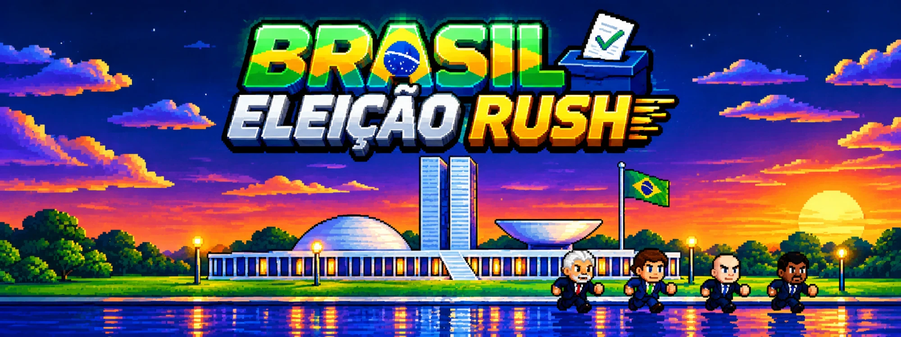

# BRASIL — ELEIÇAO RUSH


Um jogo de plataforma completo no estilo dos clássicos de 16 bits, feito **100% em
HTML5 + Canvas + JavaScript puro**. Sem engine, sem build, sem dependências:
é só abrir o `index.html` no navegador.

Todos os gráficos são desenhados por código (vetorial, em tempo real) e toda a
trilha sonora e os efeitos são sintetizados via **WebAudio** — o projeto não usa
nenhum arquivo de imagem ou áudio.

---

## Como jogar

Abra `index.html` no navegador.
Se o navegador bloquear os scripts locais, rode um servidor simples:

```bash
node serve.js
```

E acesse <http://localhost:7788>.

### Controles

| Tecla | Ação |
|---|---|
| Setas / A D | Andar e virar |
| Seta para baixo (em movimento) | Rolar |
| Baixo + Pulo | Spin Dash (segure para carregar, solte o baixo) |
| Espaço / Z / J | Pular |
| Pulo no ar (2ª vez) | Voar |
| X / Shift | Planar no ar · Virar Super (com 6 esmeraldas e 50 anéis) |
| Enter / P | Pausar |
| Esc | Voltar / cancelar |

Também funciona com **controle (gamepad)** e com **botões na tela** no celular.

---

## Personagens

Caricaturas desenhadas por código (nenhuma imagem externa), cada uma com sua
própria fala tocada na tela de seleção.

**Todos os quatro têm exatamente os mesmos poderes, a mesma velocidade e o
mesmo pulo** — nenhum personagem fica travado em nenhuma fase. O que muda entre
eles é a aparência e o que cada um coleta.

| Habilidade | Como usar |
|---|---|
| **Voar** | Aperte o pulo de novo no ar (e vá apertando para subir) |
| **Drop Dash** | Segure o pulo depois de saltar e caia rolando em alta velocidade |
| **Pisão** | Seta para baixo + pulo no ar: mergulha, quebra blocos e solta onda de choque |
| **Planar / Escalar** | X no ar; ao encostar numa parede, sobe por ela |
| **Spin Dash** | Baixo + pulo no chão, soltando o baixo para disparar |

| Personagem | Coleta |
|---|---|
| **Lula** | Picanhas |
| **Bolsonaro** | Pílulas azuis |
| **Alexandre de Morais** | Maços de dinheiro |
| **Renan Santos** | Anéis dourados |

Qualquer um quebra os blocos `X` rolando neles em velocidade.

O coletável de cada um vale na fase, na fase especial e no monitor de item, e o
HUD muda junto (PICANHAS, PILULAS, DINHEIRO ou ANEIS).

As vozes ficam em `audio/` (`lula.mp3`, `bolsonaro.mp3`, `alexandre.mp3`,
`renan.mp3`), junto do tema do chefe (`boss-daniel.mp3`) — troque os arquivos mantendo os nomes para mudar as falas.

Na tela de seleção a fala toca ao entrar e a cada vez que você muda de
personagem, com a música abaixada automaticamente para não atrapalhar. Aperte
**X** para ouvir de novo. A fala continua durante o cartão da zona e para quando
a fase começa.

---

## Conteúdo

- **3 zonas × 2 atos = 6 fases**, cada uma com cenário e paleta próprios
  - **Câmara dos Deputados** — plenário de madeira, painel de votação e bandeiras
  - **Senado Federal** — cúpula dourada, arquibancadas azuis e a mesa diretora
  - **Supremo Tribunal Federal** — fachada envidraçada ao pôr do sol, a estátua
    da Justiça e o espelho d'água
- **3 chefes** diferentes (bola de demolição, broca e canhão laser), todos
  pilotados por **Daniel Vocaro**. A chegada tem uma sequência de suspense —
  a música para, a tela escurece, o chão treme e o alerta pisca — e, na
  revelação, o cenário vira a sede do **Banco Master** e entra o tema dele
- **Fase especial em túnel 3D** para pegar as 6 **Esmeraldas do Caos**
- **Super forma** ao juntar as 6 esmeraldas e 50 anéis
- Anéis, monitores de item (anéis, escudo, invencibilidade, tênis velozes, 1UP),
  molas, painéis de turbo, checkpoints, espinhos, blocos quebráveis e loopings
- Badniks: Motobug, Buzzbomber, Crabmeat, Chopper, Orbinaut e morcegos
- **Telas completas**: abertura, título, menu, seleção de personagem, seleção de
  fase, opções, controles, créditos, cartão de zona, pausa, resultados do ato,
  fim de jogo/continue e final do jogo
- **Todas as fases liberadas desde o início** — vá direto em SELECIONAR FASE e
  escolha qualquer ato. CONTINUAR leva ao primeiro ato que você ainda não zerou
- Progresso salvo no navegador (esmeraldas, atos zerados, recordes de tempo e
  pontuação, opções)
- Menus com cenário da Praça dos Três Poderes ao pôr do sol, desenhado em código
- Todos os cenários são desenhados por código e rolam com parallax em camadas

---

## Física

A movimentação segue o modelo clássico dos jogos de 16 bits:

- aceleração, atrito e desaceleração (skid) separados;
- velocidade de solo (`gsp`) projetada nas rampas, com fator de inclinação
  diferente para andar e para rolar;
- sensores de chão por altura de tile (mapas de altura por coluna), o que permite
  rampas de 45°, plataformas atravessáveis por baixo e escorregar em ladeiras;
- controle no ar com arrasto, pulo de altura variável e colisão de teto/parede;
- loopings resolvidos por trajetória circular quando a velocidade é suficiente.

---

## Estrutura

```
index.html          carrega tudo na ordem certa
css/style.css       layout e escala da tela
serve.js            servidor estático opcional
js/core.js          utilidades de matemática e desenho
js/input.js         teclado, gamepad e toque
js/audio.js         sintetizador de efeitos + trilha chiptune
js/save.js          progresso em localStorage
js/gfx.js           personagens, objetos, inimigos e cenários (vetorial)
js/particles.js     partículas e pop-ups
js/chunks.js        blocos de cenário em ASCII
js/level.js         montagem do mapa, colisão e pré-renderização
js/levels.js        zonas e atos
js/entities.js      anéis, itens, molas e badniks
js/boss.js          Daniel Vocaro e suas máquinas
js/player.js        física do jogador e habilidades
js/hud.js           interface da fase
js/ui.js            componentes de menu
js/special.js       fase especial (túnel)
js/screens.js       todas as telas
audio/              falas dos personagens (MP3)
js/game.js          laço principal, câmera e sessão
```

Para criar uma fase nova, desenhe um bloco em `js/chunks.js` (32 colunas × linhas
de ASCII) e adicione o nome dele na lista `chunks` de um ato em `js/levels.js`.

---

Os personagens são caricaturas de figuras públicas, em tom de sátira. Projeto
educacional, sem fins lucrativos.
